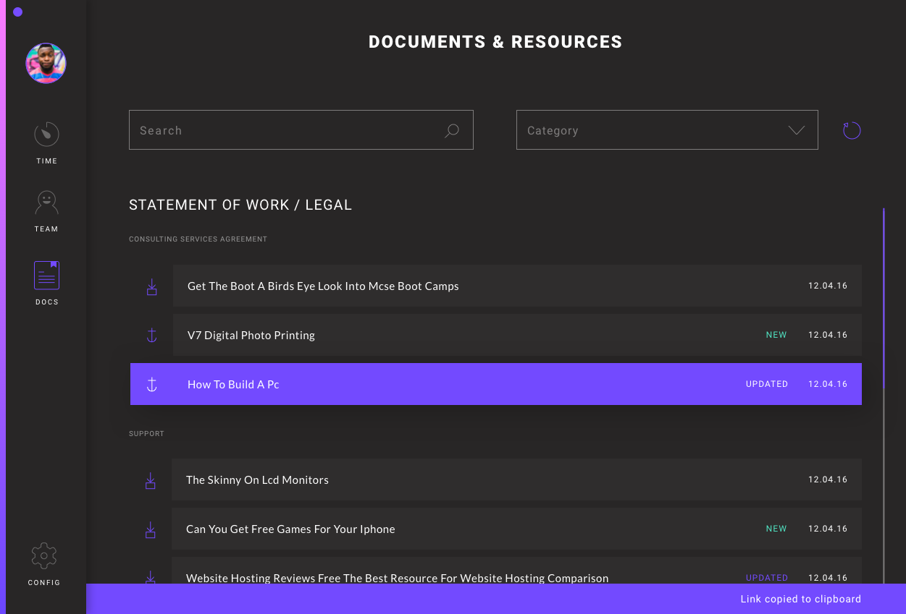

# Artboards

This is an autogenerated file showing all the artboards. Do not edit it directly.

## App - Sidebar

## Button - Blue - Active

## Button - Blue - Inactive

## Calendar - Day

## Concept 1

## Concept 2

## Concept 3

## Config - App Settings

## Config - Profile

## Field - Checkbox - Active

## Field - Checkbox - Contrast - Active

## Field - Checkbox - Contrast - Inactive

## Field - Checkbox - Inactive

## Field - File Upload - Active

## Field - File Upload - Contrast - Inactive

## Field - File Upload - Inactive

## Field - Radio - Active

## Field - Radio - Contrast - Active

## Field - Radio - Contrast - Inactive

## Field - Radio - Inactive

## Field - Range - Contrast

## Field - Range - Min

## Field - Range

## Field - Search - Active

## Field - Search - Contrast - Active

## Field - Search - Inactive

## Field - Select - Inactive

## Field - Text - Active

## Field - Text - Contrast - Active

## Field - Text - Inactive

## Field - Textarea - Active

## Field - Textarea - Contrast - Inactive

## Field - Textarea - Inactive

## Icon - Pause - Inactive

## Icon - Play - Active

## Icon - Team - Green

## Icon - Team - Grey

## Icon - Team - Purple

## Icon - Team - Red

## Icon - Team - Yellow

## Login - Dashboard

## Login - Loading

## Login - Sign In

## Nav - Docs - Active

## Nav - Settings - Inactive

## Nav - Settings

## Nav - Team - Active

## Nav - Team

## Nav - Time - Active

## Nav - Time

## Notification - Minor - Error

## Notification - Minor - Success

## Resources

## Team - Directory

## Team - Item - Active

## Team - Item - Inactive

## Team - Profile - Feedback

## Team - Profile - Time Tracking

## Team - Profile

## Time - Filter

## Time - Header

## Time - Track - Item

## Time Tracking - Edit Time

## Time Tracking - Metrics

## Time Tracking

## Type - Title

## UI - Scrollbar

## Widget - Chart - Contrast - Inactive

## btn - small - inactive

## document item -active

## document item

## header

## icn - anchor

## icn - arrow

## icn - download - active

## icn - download

## icn - link - active

## state - new - active

## state - new

## state - updated - active

## state - updated

